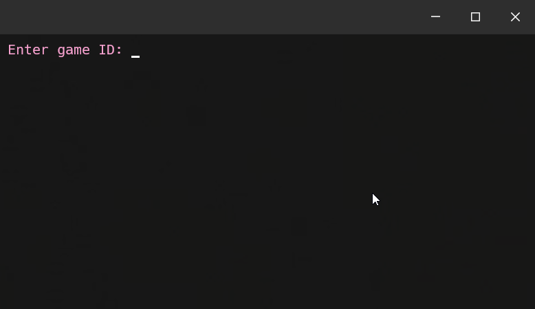
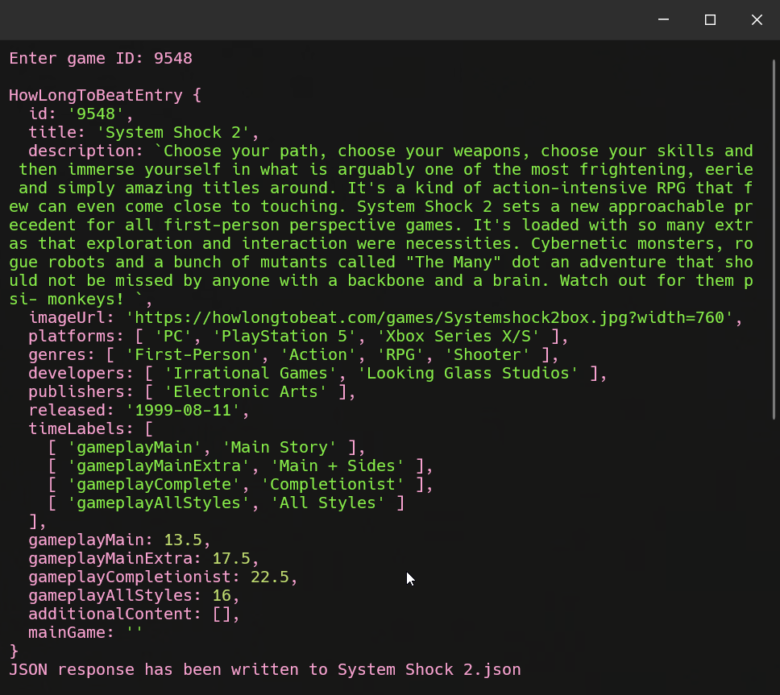

# HowLongToBeat Scraper

This is a simple scraper to get information about games from [HowLongToBeat](https://howlongtobeat.com).

The project is based on [ckatzorke](https://github.com/ckatzorke) [Howlongtobeat API](https://github.com/ckatzorke/howlongtobeat).

## Usage

Navigate to the project directory and install dependencies with:

```npm install```

Run main. Feed it an id and the response will be written in the json_outputs directory found in the root of the project.



